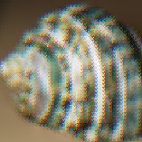

# Upscaler

- [Upscaler](#upscaler)
  - [Installation](#installation)
  - [Usage](#usage)
  - [Comparision with other Image Upscaling Algorithms](#comparision-with-other-image-upscaling-algorithms)

Upscaling images for fun and profit.

## Installation

First ensure, `rustup` is installed. If not, got to https://rustup.rs/ and follow the instructions.

For Unix environments, install `rustup` by running -

```
curl --proto '=https' --tlsv1.2 -sSf https://sh.rustup.rs | sh
```

Then, after restarting shell, run -

```
cargo install --git https://github.com/DhruvDh/upscaler
```

## Usage

See via `upscaler --help`

```
Upscaler 0.1.0
Dhruv D. <ddhamani@uncc.edu>
Upscales images

USAGE:
    upscaler [OPTIONS] <INPUT> <OUTPUT>

FLAGS:
    -h, --help       Prints help information
    -V, --version    Prints version information

OPTIONS:
    -s, --scale <scale>    Scaling factor [default: 2]  [possible values: 2, 4, 8, 16, 32]

ARGS:
    <INPUT>     The input image to upscale [possible types: hdr, bmp tga, tiff, dxt, gif, jpeg, png, pnm, webp]
    <OUTPUT>    The output image to write [possible types: jpeg, png]
```

## Comparision with other Image Upscaling Algorithms

Note that all algorithms produce visually better results when input images are larger.

| Algorithm     | Image                                                                                                                     | Description                                    |
| ------------- | ------------------------------------------------------------------------------------------------------------------------- | ---------------------------------------------- |
| Input Image   |                                               | The input images. (40 by 40px and 109 by 40px) |
| Orignal Image |  | Original image for reference (160 by 160 px)    |
| Nearest-neighbor interpolation |   | One of the simpler ways of increasing the size is nearest-neighbor interpolation, replacing every pixel with a number of pixels of the same color. The resulting image is larger than the original, and preserves all the original detail, but has (possibly undesirable) jaggedness. The diagonal lines of the "W", for example, now show the "stairway" shape characteristic of nearest-neighbor interpolation. Other scaling methods below are better at preserving smooth contours in the image. |
| Bilinear interpolation |   | Linear (or bilinear, in two dimensions) interpolation is typically good for changing the size of an image, but causes some undesirable softening of details and can still be somewhat jagged. |
| Bicubic interpolation |   | Better scaling methods include bicubic interpolation and Lanczos resampling. |
| Fourier-based interpolation |   | Simple Fourier based interpolation based on padding of the frequency domain with zero components (a smooth-window-based approach would reduce the ringing). Beside the good conservation of details, notable is the ringing and the circular bleeding of content from the left border to right border (and way around). |
| Upscaler |   | TODO |
| Edge-directed interpolation algorithms |   | Edge-directed interpolation algorithms aim to preserve edges in the image after scaling, unlike other algorithms which can produce staircase artifacts around diagonal lines or curves. Examples of algorithms for this task include New Edge-Directed Interpolation (NEDI), Edge-Guided Image Interpolation (EGGI), Iterative Curvature-Based Interpolation (ICBI), and Directional Cubic Convolution Interpolation (DCCI). |
| hqx |   | For magnifying computer graphics with low resolution and few colors (usually from 2 to 256 colors), better results will be achieved by hqx or other pixel art scaling algorithms. These produce sharp edges and maintain high level of detail. |
